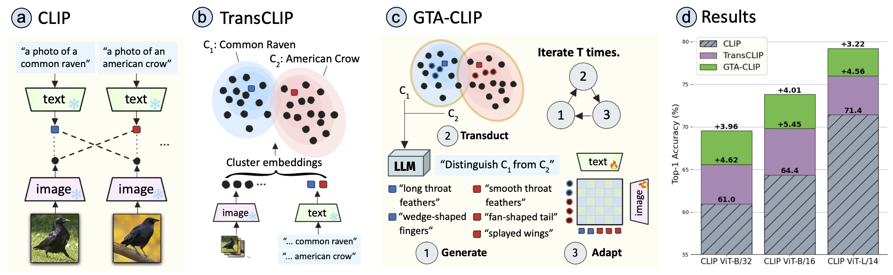
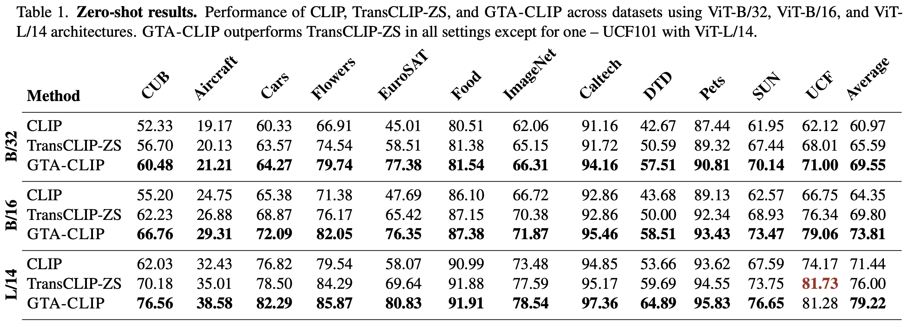

# Generate, Transduct, Adapt: Iterative Transduction with VLMs 
This is the code-base for GTA-CLIP proposed in

### Generate, Transduct, Adapt: Iterative Transduction with VLMs 

[Oindrila Saha](http://oindrilasaha.github.io), [Logan Lawrence](https://www.linkedin.com/in/logan-lawrence-5a4782158), [Grant Van Horn](https://gvh.codes), [Subhransu Maji](http://people.cs.umass.edu/~smaji/) 

ICCV'2025

<h3 align="center">
  <a href="https://arxiv.org/abs/2501.06031">[arXiv]</a> | 
  <a href="https://github.com/cvl-umass/GTA-CLIP">[Poster]</a> |
  <a href="https://github.com/cvl-umass/GTA-CLIP  ">[Video]</a>
</h3>



### Overview of GTA-CLIP

(a) Vision-language models (VLMs) such as CLIP [36] enable zero-shot classification using similarity between text embeddings of class prompts and images.  
(b) Transductive CLIP [61] exploits the structure of entire image dataset to assign images to classes improving accuracy.  
(c) Our approach, GTA-CLIP, iteratively  
  (i) induces structure over classes in language space by generating attributes based on pairwise confusions,  
  (ii) performing attribute-augmented transductive inference, and  
  (iii) adapting CLIP encoders using the inferred labels.  
(d) Across 12 datasets we improve upon CLIP and transductive CLIP by 8.6% and 4.0% using VIT-B/32, and similarly for other encoders. Significant improvements are also reported in the few-shot setting.

### Preparation
Create a conda environment with the specifications
```bash
conda create -y --name GTACLIP python=3.10.0
conda activate GTACLIP
pip3 install -r requirements.txt
export TOKENIZERS_PARALLELISM=true
```

#### Datasets
Please follow [DATASETS.md](DATASETS.md) to install the datasets.
For CUB dataset, follow [AdaptCLIPZS](https://github.com/cvl-umass/AdaptCLIPZS)

#### Static LLM Attributes
Download "gpt_descriptions" from [AdaptCLIPZS](https://github.com/cvl-umass/AdaptCLIPZS)
---

#### Running GTA-CLIP
```bash
python run_gtaclip.py --dataset <dataset_name> --root_path </path/to/datasets/folder> --backbone <clip_backbone> --gpt_path </path/to/adaptclizs/visual/attributes --gpt_path_location </path/to/adaptclizs/location/attributes
```
On completion this code will print the accuracies of base CLIP, TransCLIP, and GTA-CLIP for the specified dataset. The --root_path should be assigned to the folder containing all the datasets. --backbone is the CLIP architecture eg. 'vit_b16'. The --gpt_path is the path to the folder containing GPT generated attributes for the specific dataset which can be obtained from [AdaptCLIPZS](https://github.com/cvl-umass/AdaptCLIPZS). Note that only CUB and Flowers datasets have the --gpt_path_location attributes. The results should be close to this table:



Todo: Code for few-shot results

Thanks to [TransCLIP](https://github.com/MaxZanella/transduction-for-vlms) for releasing the code base which our code is built upon.

---

## Citation

If you find our work useful, please consider citing:

```
@article{saha2025generate,
  title={Generate, Transduct, Adapt: Iterative Transduction with VLMs},
  author={Saha, Oindrila and Lawrence, Logan and Van Horn, Grant and Maji, Subhransu},
  journal={arXiv preprint arXiv:2501.06031},
  year={2025}
}
```


